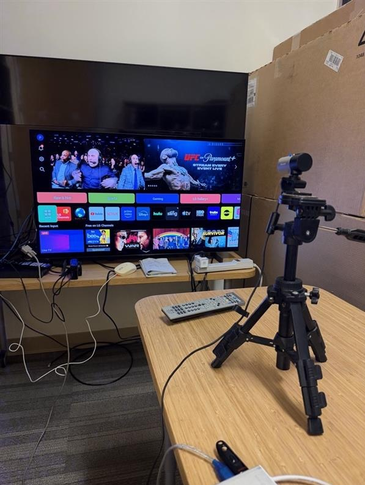

# LGC Perf TC – LG Channels Performance Test Suite

Automated performance measurement tool for LG TV (webOS) using camera-based motion detection and RS-232 serial control.

---

## Test Environment

| Item | Detail |
|------|--------|
| **TV** | LG TV (webOS, RS-232 serial port) |
| **Camera** | USB webcam on tripod, index 1 (`initialize_camera(1)`) |
| **Serial** | RS-232 → USB adapter, default `COM10`, `115200 baud` |
| **Smart Plug** | Kasa SmartPlug (TP-Link) for AC power cycle (TC01, TC02, TC06/07/08, TC10) |
| **Host PC** | Windows 11, Python 3.x |
| **Home bar app order** | `[1] LG Channels` `[2] YouTube` `[3] Netflix` `[4] Amazon` |

### Hardware Setup



```
[TV] ──RS-232──► [USB-Serial Adapter] ──► [Laptop]
[TV screen] ◄──── [USB Camera on tripod] ──► [Laptop]
[TV AC plug] ──► [Kasa SmartPlug] ──► [Wall outlet]
```

---

## Test Cases

| TC | File | Description | Trigger Key |
|----|------|-------------|-------------|
| TC01 | `LGC_TC1_RegularBoot.py` | Regular boot – LGC load time | OK |
| TC02 | `LGC_TC2_ColdBoot.py` | Cold boot – LGC cold launch time | OK |
| TC03 | `LGC_TC3_ChZapping.py` | Channel zapping (ChDown → ChUp) | ChUp |
| TC04 | `LGC_TC4_ChNumPress.py` | Channel number press (11-1 → 450) | OK |
| TC05_NtN | `LGC_TC5_NtN.py` | Native → Native channel switch | ChUp |
| TC05_NtP | `LGC_TC5_NtP.py` | Native → Pluto channel switch | ChUp |
| TC05_PtP | `LGC_TC5_PtP.py` | Pluto → Pluto channel switch | ChUp |
| TC06/07/08 | `LGC_TC678_MovTV_ScrollVH.py` | LGC Movies & TV – select / scroll V / scroll H | OK / DpadDn / DpadRt |
| TC10 | `LGC_TC10_realWorld01.py` | Real World 01 – Amazon → Netflix → YouTube → LGC | OK |
| TC11 | `LGC_TC11_realWorld02.py` | Real World 02 – DC cycle → Netflix → YouTube → PIP → LGC | OK |
| TC12 | `LGC_TC12_realWorld03.py` | Real World 03 – DC cycle → Netflix → YouTube → PIP→FS → LGC | OK |

---

## Estimated Run Time (5 runs per TC)

> Includes power cycle waits, boot stabilization, app playback durations, and camera-based stable detection.

| TC | Per Run | 5 Runs |
|----|---------|--------|
| TC01 | ~4.5 min | ~22 min |
| TC02 | ~2 min | ~10 min |
| TC03 | ~1 min | ~5 min |
| TC04 | ~4 min | ~21 min |
| TC05_NtN | ~0.5 min | ~2.5 min |
| TC05_NtP | ~0.5 min | ~2.5 min |
| TC05_PtP | ~0.5 min | ~2.5 min |
| TC06/07/08 | ~6 min | ~30 min |
| TC10 | ~15 min | ~75 min |
| TC11 | ~15 min | ~75 min |
| TC12 | ~15 min | ~75 min |
| **Total (all TCs)** | | **~5–6 hours** |

TC10/11/12 account for ~75% of total run time due to app playback and DC power cycle waits.

---

## Full Suite Runner

Run all TCs in one session with shared config:

```bash
python LGC_TC_FullSuite.py
```

- Select TCs interactively (Enter = all, or e.g. `1,2,3`)
- Single config input: IP, COM port, SoC, SWV, LGCV, runs, timeout
- Results saved to `C:/Temp/LGC_FullSuite_YYYYMMDD_HHMMSS.csv`

---

## Key Features

- **Camera-based motion detection** – measures response time from key press to first visible screen change
- **`wait_for_screen_stable()`** – time-based stability check (4s continuous); avoids false positives from brief loading UIs (e.g. YouTube 2-3s static frames)
- **`wait_for_app_ready()`** – 2-phase: detects motion start (app loading) then waits for stable (app ready)
- **Trigger/completion sounds** – `800Hz` beep on key press, `1500→2500Hz` ascending tones on motion detected
- **K25Lp / other SoC** – `P_ON` RS-232 command sent after DC cycle; 180s boot stabilization

---

## Dependencies

Install the required packages from `requirements.txt`:

```bash
python -m pip install -r requirements.txt
```

Alternatively install required packages manually:

```bash
pip install opencv-python numpy pandas pyserial python-kasa keyboard
```

> `winsound` is included in the Python standard library on Windows and does not need to be installed separately.

---

## Output

Results are appended to CSV with columns:

```
TC, Run, Timestamp, Response_Time_ms, Frames, Status, Directory
```

Frame captures saved under `C:/Temp/LGC_Perf_<TC>_<run>_<timestamp>_<SoC>_SWV<ver>_LGCV<ver>/`
